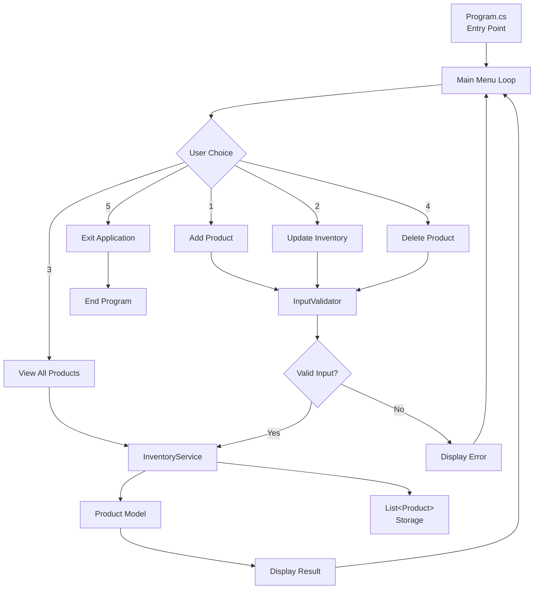
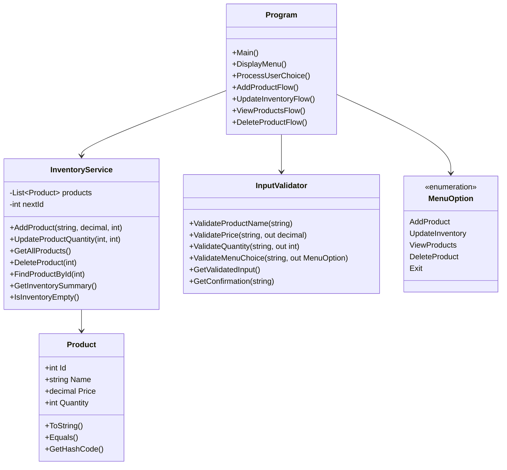
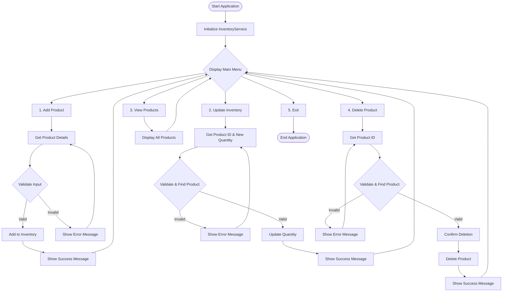

# Inventory Management System

## Project Description

The Inventory Management System is a console-based C# application designed to help users manage product inventory efficiently. This system provides a command-line interface for performing essential inventory operations including adding products, updating stock levels, viewing inventory status, and removing products from the system.

This project serves as a certification assignment demonstrating fundamental C# programming concepts including control structures, loops, method definitions, and object-oriented programming principles.

## Project Requirements and Goals

### Functional Requirements

- **Add Products**: Create new products with name, price, and stock quantity
- **Update Inventory**: Modify stock levels for existing products (sales/restocking)  
- **View Products**: Display all products with current inventory levels
- **Delete Products**: Remove products from the inventory system
- **Input Validation**: Ensure data integrity with proper validation
- **Error Handling**: Graceful handling of invalid inputs and edge cases

### Technical Requirements

- **Control Structures**: Implementation of `if-else` and `switch` statements ✅
- **Loops**: Use of `while` loops for iteration ✅
- **Methods**: Custom method definitions and invocations beyond Main() ✅
- **Console Interface**: Interactive command-line user interface ✅
- **In-Memory Storage**: Use of `List<Product>` for data persistence during runtime ✅

### Non-Functional Requirements

- **Usability**: Intuitive menu-driven interface
- **Reliability**: Robust error handling and input validation
- **Maintainability**: Clean code structure with separation of concerns
- **Documentation**: Comprehensive code documentation and user guides

## Design Schema

### System Architecture



### Class Diagram



### Application Flow



## Setup and Running Instructions

### Prerequisites

- .NET 8.0 or later installed on your system
- Visual Studio Code or any C# compatible IDE
- Git for version control

### Installation Steps

1. **Clone the Repository**

   ```bash
   git clone <repository-url>
   cd InventorySystem
   ```

2. **Build the Project**

   ```bash
   dotnet build
   ```

3. **Run the Application**

   ```bash
   dotnet run
   ```

### Project Structure

```text
InventorySystem/
├── Program.cs                  # Main entry point with UI logic
├── Models/
│   └── Product.cs             # Product entity class
├── Services/
│   └── InventoryService.cs    # Business logic for inventory operations
├── Utils/
│   ├── InputValidator.cs      # Input validation helpers
│   └── MenuOption.cs          # Menu enumeration
└── InventorySystem.csproj     # C# project file
```

## Usage Examples

### Adding a Product

```text
=== Inventory Management System ===
1. Add Product
2. Update Inventory
3. View All Products
4. Delete Product
5. Exit

Enter your choice (1-5): 1

=== Add New Product ===
Enter product name: Laptop
Enter product price: $999.99
Enter product quantity: 10

✓ Product 'Laptop' added successfully!
Product Details: ID: 1 | Name: Laptop | Price: $999.99 | Quantity: 10
```

### Viewing Inventory

```text
Enter your choice (1-5): 3

=== Current Inventory ===
ID   | Name                 | Price      | Quantity
--------------------------------------------------
1    | Laptop              | $999.99    | 10      
2    | Mouse               | $25.50     | 50      
3    | Keyboard            | $75.00     | 25      
--------------------------------------------------
Total Products: 3
Total Inventory Value: $12374.99

⚠️  Low Stock Alert:
   - Keyboard (Quantity: 3)
```

### Updating Inventory

```text
Enter your choice (1-5): 2

=== Update Product Inventory ===

Current Products:
  1. Laptop (Qty: 10)
  2. Mouse (Qty: 50)
  3. Keyboard (Qty: 25)

Enter product ID to update: 1
Current product: ID: 1 | Name: Laptop | Price: $999.99 | Quantity: 10
Enter new quantity: 8

✓ Product 'Laptop' quantity updated to 8 successfully!
Updated Details: ID: 1 | Name: Laptop | Price: $999.99 | Quantity: 8
```

## Key Features Implemented

### Required C# Concepts

✅ **Control Structures**:
- `if-else` statements for input validation and error handling
- `switch` statement for menu navigation
- Conditional logic throughout the application

✅ **Loops**:
- `while` loops in main menu and input validation
- `for` loops for displaying product lists
- Iteration over collections using LINQ

✅ **Methods**:
- Custom methods defined in all classes
- Method overloading and overriding
- Static and instance methods

### Additional Features

- **Exception Handling**: Comprehensive try-catch blocks
- **Input Validation**: Robust validation for all user inputs
- **Data Persistence**: In-memory storage using `List<Product>`
- **User Experience**: Clear menus, confirmations, and feedback
- **Code Documentation**: XML documentation comments
- **Low Stock Alerts**: Automatic warnings for low inventory
- **Duplicate Prevention**: Prevents adding products with existing names

## Development Standards

- **Language**: All code and comments written in English
- **Naming Conventions**: PascalCase for classes, camelCase for methods and variables
- **Code Documentation**: Comprehensive XML documentation comments
- **Error Handling**: Try-catch blocks with meaningful error messages
- **Testing**: Manual testing of all features and edge cases
- **SOLID Principles**: Single Responsibility and Separation of Concerns

## Testing Scenarios Covered

1. **Adding Products**:
   - Valid product creation
   - Duplicate name prevention
   - Invalid price/quantity handling

2. **Updating Inventory**:
   - Valid quantity updates
   - Non-existent product handling
   - Negative quantity prevention

3. **Viewing Products**:
   - Empty inventory display
   - Formatted product listing
   - Low stock alerts

4. **Deleting Products**:
   - Successful deletion with confirmation
   - Non-existent product handling
   - Cancellation support

5. **Input Validation**:
   - Invalid menu choices
   - Empty/null inputs
   - Non-numeric inputs for numbers

## Project Goals Achievement

✅ **Demonstrate C# Fundamentals**: Successfully showcased control structures, loops, and methods
✅ **Apply OOP Principles**: Implemented classes with proper encapsulation and separation of concerns
✅ **Create User-Friendly Interface**: Developed intuitive console-based navigation with clear feedback
✅ **Ensure Code Quality**: Written clean, well-documented, and maintainable code
✅ **Practice Software Design**: Applied proper architecture with Models, Services, and Utils separation

## License

This project is created for educational and certification purposes.
